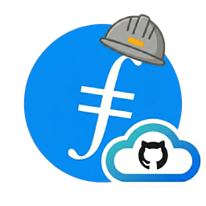

# FOC GH

Chromium Manifest V3 **browser extension** for **FOC TPMs and team members** working in GitHub. It helps with things like connecting day-to-day issue and PR work to the [FOC Project Board](https://github.com/orgs/FilOzone/projects/14).

## Features

1. **Make FOC's project board "global" (i.e., support cross-org issues and PRs)** — Manage the board (add items, edit fields where the API allows) from GitHub issues and pull requests on configured repos, with a native-style sidebar and **autosave** for supported field types (single select, number, text, iteration).
2. **Global auto-expand for project panels** — Optional setting so GitHub’s right-hand **Project** panel **auto-expands** for issues and PRs (works across projects, not only FOC).

### 🎥 2026-03-29 Demo

https://github.com/user-attachments/assets/3610e84f-d0cb-42b0-a0d6-4309f9dcd29b

## Fastest way to start using it
### Chrome Web Store
Coming soon - waiting on Web Store approval.

### Build/install locally
1. Check out the repo.
2. Run **`npm install`**.
3. Run **`npm run build`**.
4. Open **`chrome://extensions`**, enable **Developer mode**, **Load unpacked**, and choose **[extension/dist/](extension/dist/)** (build output from the repo root).
5. Create a classic PAT following [PAT permissions](docs/github-pat-permissions.md#classic-personal-access-tokens).
6. Save the PAT in the extension **Options** page.

*(OAuth for local builds is documented in [extension/README.md](extension/README.md); it needs GitHub OAuth client values in `.env.local` before **`npm run build`**. Ask **FilOzone maintainers** if you need those credentials.)*

## For developers

The **Fastest way** steps above cover PAT + unpacked install; full developer setup (**Chrome Web Store** ZIP, **`npm run build:zip`**, both OAuth apps, extension IDs) lives in **[extension/README.md](extension/README.md)** (read from the **repository root**, not only from [extension/](extension/)). That guide lists the **local** extension ID (stable via committed [extension/manifest-id-public.b64](extension/manifest-id-public.b64)) vs the **Chrome Web Store** listing ID, and links to FilOzone’s **two** GitHub OAuth apps (dev vs prod).

## Build & distribution

| Need | Where |
|------|--------|
| **Local unpacked** build, stable extension ID, dev OAuth | [extension/README.md](extension/README.md) — *Local / unpacked* and *Extension IDs* |
| **Chrome Web Store** ZIP (no `manifest.key`), production OAuth | [extension/README.md](extension/README.md) — *Chrome Web Store ZIP* |
| OAuth apps, callbacks, FilOzone links | [docs/github-oauth-app.md](docs/github-oauth-app.md) |
| Env vars, Actions secret names | [.env.example](.env.example) |
| Manual smoke checklist (CI, zip, local) | [specs/005-build-distribution-workflows/quickstart.md](specs/005-build-distribution-workflows/quickstart.md) |

CI: [.github/workflows/extension-ci.yml](.github/workflows/extension-ci.yml) runs on push/PR (see [extension/README.md](extension/README.md)).

## Documentation

- **[docs/canonical-test-urls.md](docs/canonical-test-urls.md)** — Canonical **issue/PR URLs** and **expected Project panel / FOC behavior** for manual regression testing (see [CONTRIBUTING.md](CONTRIBUTING.md))
- **[docs/global-boards-picker-status.md](docs/global-boards-picker-status.md)** — Global boards **Projects** picker is “Coming soon”; add/remove from the picker is not implemented yet
- **[extension/README.md](extension/README.md)** — Build, FilOzone OAuth (dev vs production), PAT vs **Connect GitHub**, configuration
- [docs/github-pat-permissions.md](docs/github-pat-permissions.md) — PAT / OAuth scope reference
- [docs/github-oauth-app.md](docs/github-oauth-app.md) — OAuth app registration and callback URLs
- [specs/](specs/) — Feature specs and plans
